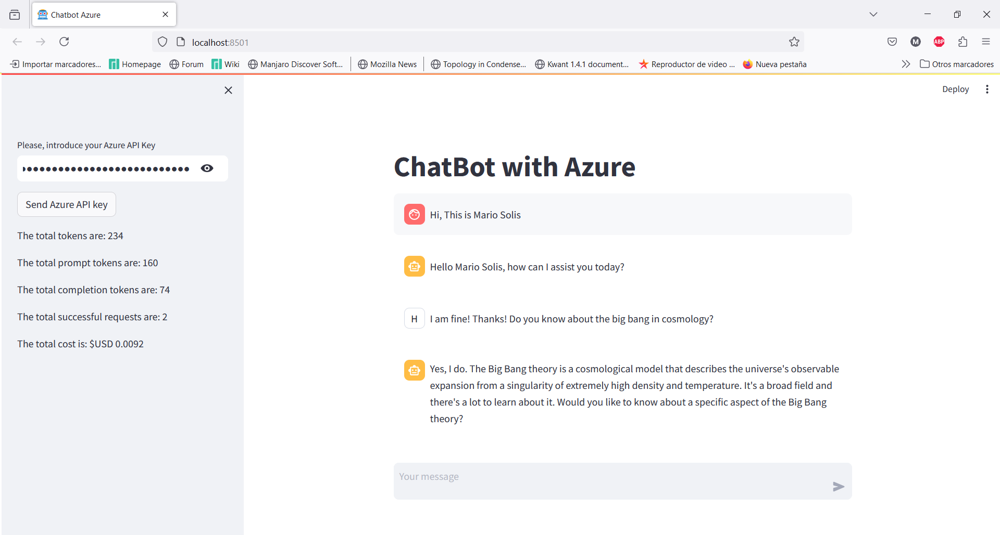

# This is a Chatbot with Azure 
This is a short chatbot assistant with Azure. One important thing of this chatbot is not streaming. 

One special feature, the GUI is made in Streamlit and it shows in lateral box the total count of tokens and cost during all the conversation. This is useful for give us a good idea about the cost.

Here there are a pick of the chatbot
